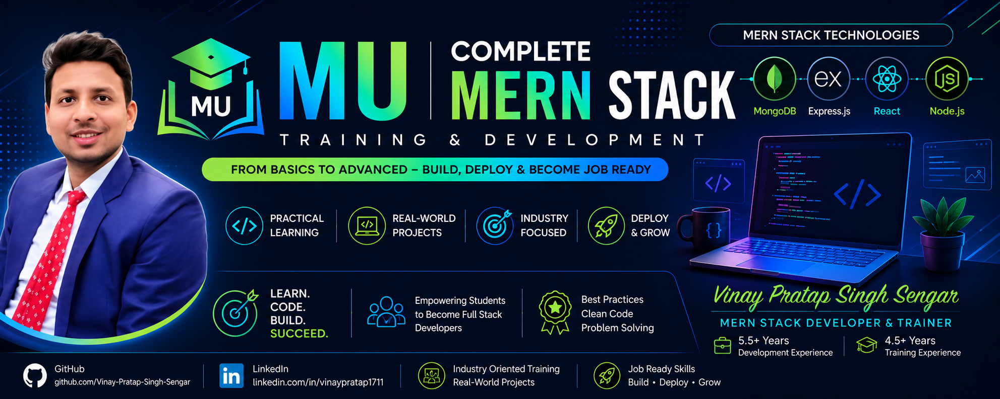

<p align="center">
  
</p>
# 🚀 MU - Complete MERN Stack Training Repository

Welcome to the **MU (MERN University)** repository.

I am **Vinay Pratap Singh Sengar**, a **MERN Stack Developer & Technical Trainer** with **5.5+ years of development experience** and **4.5+ years of training experience**. This repository is created to provide **complete hands-on training for the MERN Stack** from **beginner to advanced level**.

---

## 👨‍🏫 About the Trainer

**Vinay Pratap Singh Sengar**

* MERN Stack Developer (5.5+ Years)
* Technical Trainer (4.5+ Years)
* Trainer for **Java, C++, JavaScript, React, Node.js, Express.js, MongoDB, and DSA**
* Focused on **industry-oriented practical learning**
* GitHub: **Vinay-Pratap-Singh-Sengar**

---

# 📚 What You Will Learn

This repository covers the **complete MERN Stack roadmap** with theory, practicals, assignments, and projects.

## 🌐 Frontend Development

### HTML5

* Semantic HTML
* Forms & Validation
* Tables & Media
* Accessibility basics

### CSS3

* Selectors & Box Model
* Flexbox & Grid
* Responsive Design
* Animations & Transitions
* Media Queries

### JavaScript (ES6+)

* Variables & Data Types
* Functions & Arrow Functions
* Arrays & Objects
* DOM Manipulation
* Events
* Async JavaScript
* Promises & Async/Await
* Fetch API

---

# ⚛️ React.js

* React Fundamentals
* Components & JSX
* Props & State
* Event Handling
* Conditional Rendering
* Lists & Keys
* React Hooks

  * useState
  * useEffect
  * useContext
  * useReducer
* React Router
* Context API
* Form Handling
* API Integration
* Project Structure
* Performance Optimization

---

# 🟢 Node.js

* Node.js Runtime
* Modules
* File System
* HTTP Module
* NPM & Package Management
* Environment Variables
* Event Loop

---

# 🚂 Express.js

* Express Server Setup
* Routing
* Middleware
* REST API Development
* Error Handling
* Authentication
* Authorization
* File Uploads
* MVC Architecture

---

# 🍃 MongoDB

* MongoDB Basics
* CRUD Operations
* Collections & Documents
* Query Operators
* Aggregation
* Indexing
* MongoDB Atlas
* Mongoose ODM
* Relationships & Populate

---

# 🔐 Authentication & Security

* Password Hashing (bcrypt)
* JWT Authentication
* Protected Routes
* Role-based Access Control
* CORS
* Helmet
* Input Validation
* Security Best Practices

---

# 📦 Tools & Technologies

| Category        | Tools                     |
| --------------- | ------------------------- |
| Editor          | VS Code                   |
| Version Control | Git & GitHub              |
| API Testing     | Postman                   |
| Database GUI    | MongoDB Compass           |
| Deployment      | Render / Vercel / Netlify |
| Package Manager | npm                       |

---

# 📁 Repository Structure

```text
MU/
│
├── HTML/
├── CSS/
├── JavaScript/
├── React/
├── NodeJS/
├── Express/
├── MongoDB/
├── MERN-Projects/
├── DSA/
├── Notes/
├── Assignments/
└── README.md
```

---

# 🧪 Hands-on Projects

This repository includes multiple real-world projects such as:

### Beginner Projects

* Calculator
* To-Do App
* Weather App
* Quiz App

### Intermediate Projects

* Expense Tracker
* Student Management System
* Blog Application
* Movie Search App

### Advanced MERN Projects

* E-Commerce Application
* Authentication System
* Learning Management System
* Real-time Chat Application
* Admin Dashboard

---

# 📝 Daily Practice & Updates

I update this repository **daily** with:

* Class notes
* Lab programs
* Practice questions
* Assignments
* Mini projects
* Interview questions
* Industry use cases

---

# 🎯 Learning Outcome

After completing this repository, students will be able to:

* Build responsive frontend applications
* Develop RESTful APIs
* Work with MongoDB databases
* Implement authentication & authorization
* Create full-stack MERN applications
* Deploy applications to the cloud
* Prepare for internships and job interviews

---

# 🚀 How to Use This Repository

### Clone the repository

```bash
git clone https://github.com/Vinay-Pratap-Singh-Sengar/MU.git
```

### Open the project

```bash
cd MU
```

### Start learning module by module

* Begin with **HTML**
* Move to **CSS**
* Learn **JavaScript**
* Continue with **React**
* Learn **Node.js & Express**
* Finish with **MongoDB and full-stack projects**

---

# 📌 Recommended Learning Path

<List><List.Item><Text inline weight="semibold">HTML</Text></List.Item><List.Item><Text inline weight="semibold">CSS</Text></List.Item><List.Item><Text inline weight="semibold">JavaScript</Text></List.Item><List.Item><Text inline weight="semibold">React.js</Text></List.Item><List.Item><Text inline weight="semibold">Node.js</Text></List.Item><List.Item><Text inline weight="semibold">Express.js</Text></List.Item><List.Item><Text inline weight="semibold">MongoDB</Text></List.Item><List.Item><Text inline weight="semibold">Authentication</Text></List.Item><List.Item><Text inline weight="semibold">Full Stack Projects</Text></List.Item><List.Item><Text inline weight="semibold">Deployment</Text></List.Item></List>

---

# 🤝 Contributing

Students are encouraged to:

* Fork this repository
* Create feature branches
* Add improvements
* Submit pull requests
* Share project ideas

---

# 📧 Contact

**Vinay Pratap Singh Sengar**

* 💼 MERN Stack Developer & Trainer
* 🌐 GitHub: https://github.com/Vinay-Pratap-Singh-Sengar

---

# ⭐ Support

If you find this repository useful:

* ⭐ Star this repository
* 🍴 Fork it
* 📢 Share it with other students
* 💻 Practice the programs regularly

---

## 📢 Final Note

This repository is designed as a **complete classroom + self-learning resource** for anyone who wants to become a **Full Stack MERN Developer**.

> **Learn → Practice → Build Projects → Deploy → Get Job Ready**

Happy Coding! 🚀
